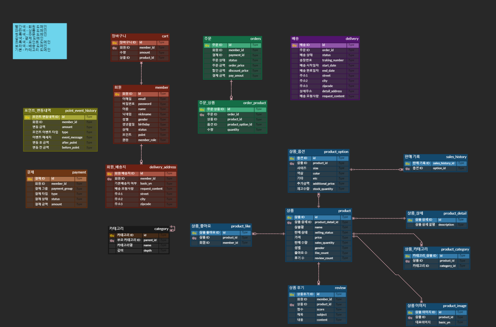
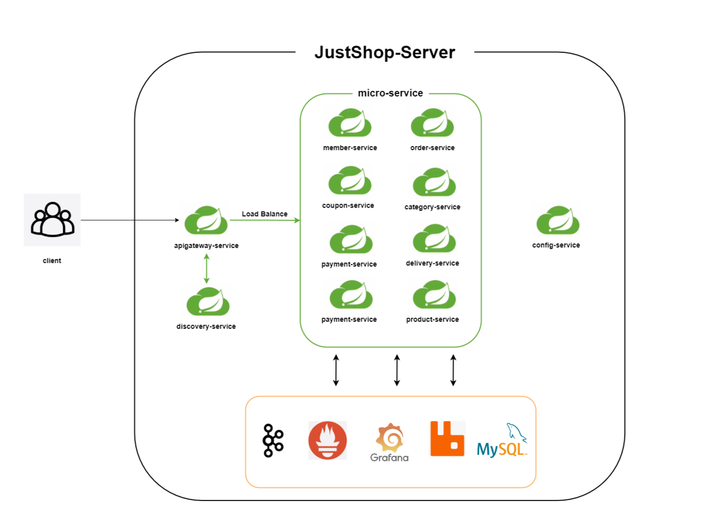

# JustShop
MSA 적용 E-Commerce Server 프로젝트

## Developer

### 개발

<table>
    <tr>
        <td>
            <a href="https://github.com/DevCHW">
                
            </a>
        </td>
    </tr>
    <tr>
        <td>
            <b>최현우</b>
        </td>
    </tr>
    <tr>
        <td>
            <b>Back-End</b>
        </td>
    </tr>
</table>

[JustShop-Github-Repository](https://github.com/DevCHW/justshop-server)

## 기술 스택
### Backend
- Java11
- Spring Boot 2.7.15
- Spring Data JPA, QueryDSL
- Spring Security
- Spring Cloud
- JUnit, Mockito

### Database
- MySQL
- H2

### DevOps
- AWS EC2
- Kafka
- RabbitMQ
- Prometheus, Grafana
- Docker
- Jenkins

## ERD
https://www.erdcloud.com/d/pRwacMeGgiNsP2wYN




## 프로젝트 아키텍처


## 모듈 구조
```
📦justshop
 ┣ 📂module-app
 ┣ 📂module-domain
 ┣ 📂module-core
 ┗ 📂module-internal
```

### module-app
실행 가능한(Runnable)한 모듈들이 위치하며 각 모듈엔 @SpringBootApplication 어노테이션이 달린main 클래스가 존재합니다. 나머지 모듈들을 전부 의존할 수 있고 배포시 빌드가 될 모듈들입니다.

### module-domain
프로젝트의 도메인 모델 클래스들과 Repository가 위치합니다. 도메인 모델을 엔티티로 규정하였기에 JPA 기술을 강하게 의존하고있고, 각각의 모듈에 위치한 엔티티들은 domain-jpa를 의존하여 BaseEntity를 상속받을 수 있고, QueryDSL 설정을 한번에 할 수 있도록 설계하였습니다. 

### module-core
모든 모듈에서 의존할 수 있는 core 모듈입니다. 해당 모듈은 다른 모든 모듈이 의존하고 있기에 변경시 전체 시스템에 영향을 미치게 됩니다. 따라서 최대한 변경이 없을만한, 다른 어떠한 의존성도 없는 순수 자바 코드만 위치할 수 있습니다. 주로 Util성 클래스, Exception 클래스 등이 위치하도록 하였습니다.

### module-internal
내부적인 시스템을 위한 모듈입니다. core-web을 제외한 모듈들은 응답의 형태로 데이터를 제공하며, core 모듈은 어떠한 기술도 의존할 수 없어야 한다는 규칙을 정해놓았기에 spring web을 의존하고 있는 core-web 모듈을 따로 분리하여 웹 관련 공통 응답, Exception 핸들링 등을 해당 모듈에 위치시켰습니다.

